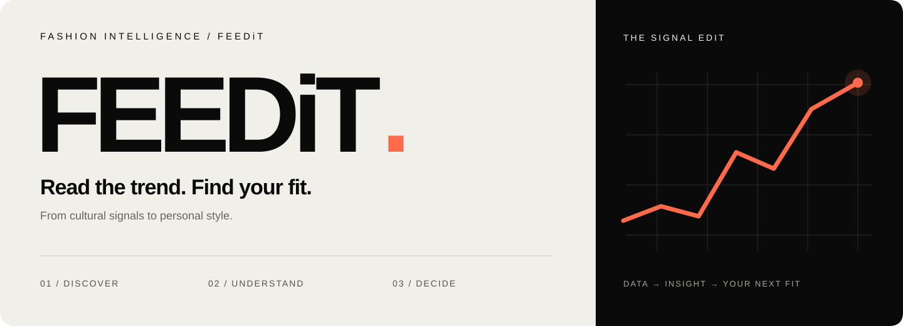
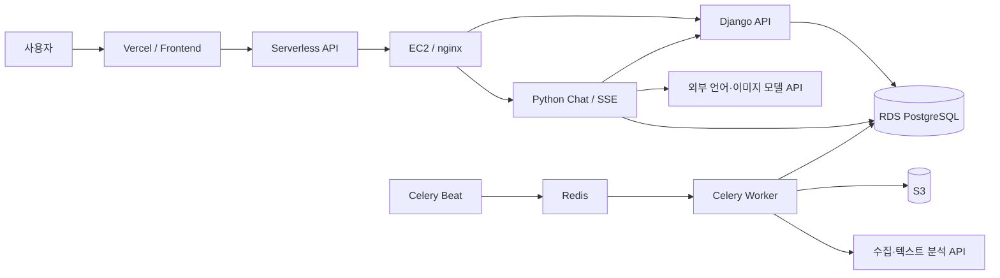

<div align="center">



**패션의 흐름을 읽고, 나에게 맞는 선택으로.**

커머스와 콘텐츠의 신호를 트렌드 분석 · AI 대화 · 살!말? 구매 판단으로 연결합니다.

[플랫폼 둘러보기](https://fee-di-t-frontend.vercel.app/) · [시스템 구성](docs/ARCHITECTURE.md) · [개발 시작](docs/DEVELOPMENT.md) · [문서 전체](docs/README.md)


</div>

## From signal to style

FEEDiT은 패션 상품·리뷰·영상·댓글·검색 신호를 수집하고, 사전 기반 정규화와 분석을 거쳐 사용자가 탐색하고 질문할 수 있는 서비스로 제공합니다. 가격과 트렌드의 **근거를 함께 보여주는 것**이 핵심입니다.

| 01 / DISCOVER | 02 / UNDERSTAND | 03 / DECIDE |
| :--- | :--- | :--- |
| **트렌드 탐색**<br>키워드 검색, 기간별 추이, 연관어, 스타일과 상품 탐색 | **AI 스타일 대화**<br>데이터 도구를 통한 지표 해석, 상품 질문, 코디 제안 | **살!말?**<br>구매 판단 지표, 커뮤니티 투표, 코디 인계와 가상 피팅 |

| 기능 | 구현 범위 |
| --- | --- |
| 트렌드 분석 | 트렌드 온도·연관어·구매의향·할인·리셀·수명주기 관련 조회와 시각화 |
| 내 피드 | 관심 키워드·저장 항목·주간 리포트·알림 |
| 스타일 탐색 | 스타일 검색, 관련 상품, 상품 이미지와 원본 링크 |
| AI 챗봇 | 일반/살말 모드, SSE 응답, 대화 기록, 근거 기반 도구 호출 |
| 가상 피팅 | 살말 모드에서 이미지 분석·코디 구성·외부 이미지 모델 호출 |
| 계정 | 가입·로그인·Google 로그인·프로필·등급·플랜 화면·알파 계정 |
| 관리자 | 수집·정규화·분석·사전·데이터 상태 점검 |

> 코드에 구현된 범위입니다. 실제 데이터의 범위와 최신성, 외부 모델 사용 가능 여부는 운영 환경에 따라 달라집니다. 플랜 화면의 존재가 결제 서비스 운영을 뜻하지는 않습니다.

## Connected by design



프론트엔드는 **Vite + Vanilla JavaScript**, 백엔드는 **Django**, 챗봇은 **Python 표준 HTTP 서버**로 분리되어 있습니다. GPU 모델 서버의 상시 운영은 이 저장소만으로 확인되지 않습니다.

[연결 구조와 배포 경계 →](docs/ARCHITECTURE.md) · [버전과 라이브러리 명세 →](docs/TECHNOLOGY.md)

## Start locally

```bash
git clone https://github.com/feedit-official/feedit.git
cd feedit
cp .env.example .env
```

환경값과 DB 접근 경로를 준비한 뒤 프론트엔드를 실행합니다.

```bash
cd frontend
nvm use
npm ci
npm run dev
```

`http://localhost:5173`에서 열립니다. API와 챗봇은 별도 프로세스이며, 프론트엔드 실행만으로 데이터 서비스가 준비되지는 않습니다. **DB·외부 질문 추출기·모델 키 준비를 포함한 전체 실행 순서는 [개발 안내](docs/DEVELOPMENT.md)를 따르세요.**

## Inside the repository

```text
frontend/    사용자 화면 · Vercel 함수 · UI/API 회귀 테스트
backend/     Django API · 관리자 · 수집 · 분석 · 데이터 모델
ChatBot/     대화 서버 · 도구 · 가상 피팅 · 회귀 테스트
docker/      로컬/운영 Compose · Dockerfile · 프록시 설정
landing/     독립 브랜드 소개 페이지
showcase/    독립 인터랙티브 쇼케이스
docs/        현재 기준 문서 · 디자인 자산 · 과거 기록
```

| 필요한 내용 | 문서 |
| --- | --- |
| 다른 채팅에 플랫폼 맥락 전달 | [플랫폼 컨텍스트](docs/PROJECT_CONTEXT.md) |
| 로컬 실행·검증 | [Development](docs/DEVELOPMENT.md) |
| Vercel·EC2·RDS·환경변수 | [Deployment](docs/DEPLOYMENT.md) |
| 데이터 수집·분석·정기 작업 | [Data pipeline](docs/DATA_PIPELINE.md) |
| 변경 규칙·협업 | [Workflow](frontend/docs/WORKFLOW.md) |
| 이번 저장소 정리 내역 | [Repository maintenance](docs/REPOSITORY_MAINTENANCE.md) |
| 이전 설계·제출 자료 | [Archive](docs/archive/README.md) |

## Built by FEEDiT

| PM | Backend | Backend | Frontend | Frontend |
| :--- | :--- | :--- | :--- | :--- |
| [유진영](https://github.com/ujneg18-source) | 고현아 | [김봉남](https://github.com/bongrybong) | [안혁진](https://github.com/Jinxxxok) | [전서연](https://github.com/sxoxyn) |

<sub>FEEDiT · 문서 기준 2026.09.22 · 버전은 저장소 선언/잠금 파일 기준입니다.</sub>

<sub>README는 자체 SVG, GitHub Mermaid, 오픈소스 [Shields](https://github.com/badges/shields)를 사용합니다. 프로젝트와 데이터의 사용 권한은 별도 확인이 필요하며, 오픈소스 의존성의 라이선스가 이 저장소 전체에 자동 적용되지는 않습니다.</sub>
