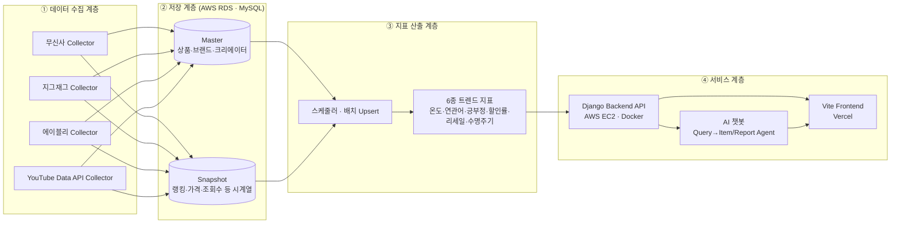
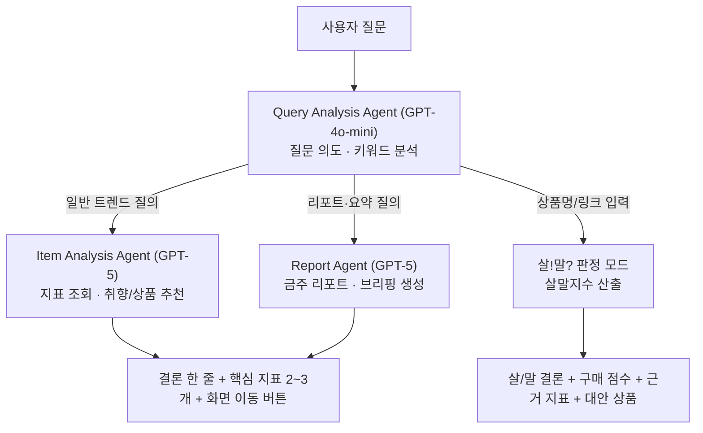
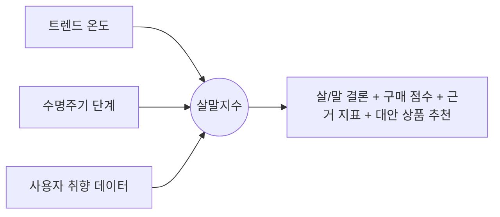
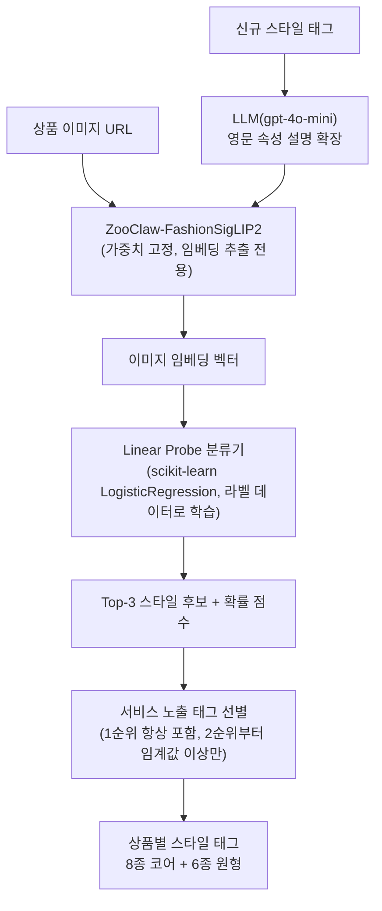
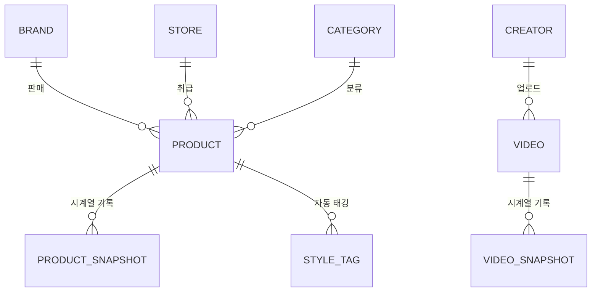

<div align="center">


# FEEDiT
### [FEEDiT - 배포 링크](https://fee-di-t-frontend.vercel.app/)

**패션 트렌드를 물어보고, 분석하고, 결정한다. 나만의 스타일 컨설팅  AI**

커머스·유튜브 데이터를 모아 6개 트렌드 지표로 계산하고, AI 챗봇이 지표를 해석해주며,   
살까 말까 고민되는 상품은 커뮤니티 투표로 정할 수 있는 AI 기반 패션 트렌드 플랫폼


</div>

---

## 목차

1. [팀 소개](#1-팀-소개)
2. [프로젝트 개요](#2-프로젝트-개요)
3. [핵심 기능](#3-핵심-기능)
4. [기술 스택](#4-기술-스택)
5. [시스템 아키텍처](#5-시스템-아키텍처)
6. [핵심 기술 상세](#6-핵심-기술-상세)
7. [데이터 설계](#7-데이터-설계)
8. [배포 정보 및 실행 방법](#8-배포-정보-및-실행-방법)

---

## 1. 팀 소개

| 유진영 | 고현아 | 김봉남 | 안혁진 | 전서연 |
| :---: | :---: | :---: | :---: | :---: |
| <a href="https://github.com/ujneg18-source"> | <a href="https://github.com/"> | <a href="https://github.com/bongrybong"> | <a href="https://github.com/Jinxxxok"> | <a href="https://github.com/sxoxyn"> |
| <b>PM</b> | <b>BE</b> | <b>BE</b> | <b>FE</b> | <b>FE</b> |

---

## 2. 프로젝트 개요

### **프로젝트명** : FEEDiT

**FEEDiT**은 무신사·에이블리·지그재그 등 국내 주요 패션 커머스와 패션 유튜브 콘텐츠 데이터를 수집·분석하여, 지금 어떤 스타일과 아이템이 뜨고 있는지를 트렌드 지표로 보여주고, AI 챗봇을 통해 "이거 사도 될지" 판단을 도와주는 LLM 기반 서비스입니다.

단순히 트렌드를 소개하는 것을 넘어, 사용자의 취향·체형·행동 데이터를 기반으로 개인화된 트렌드 브리핑과 구매 의사결정 조언을 제공하고, 살까 말까 고민되는 상품을 다른 사용자와 함께 투표하는 커뮤니티 기능(살!말?)까지 하나의 서비스 안에서 제공합니다.

```
[커머스/유튜브 데이터 수집] → [6종 트렌드 지표 산출] → [AI 챗봇 · 내 피드 개인화 안내]
                                                              └→ [살!말? 커뮤니티 투표 · 구매 결정]
                                                                        └→ [투표·만족도 데이터를 다시 개인화 추천에 반영]
```

### 2-1. 개발 배경

패션 트렌드는 하루가 다르게 변하지만, 일반 소비자가 이를 객관적인 데이터로 파악하기는 어렵습니다. FEEDiT은 누구나 한 번쯤 겪어본 쇼핑 과정의 4가지 고민에서 출발했습니다.

**기존 패션 쇼핑의 한계**

1) **감에 의존하는 트렌드** : "요즘 뜬다"는 말은 많지만, 실제 언급량이 얼마나 늘었는지, 유행의 정점을 지났는지 숫자로 보여주는 곳이 없습니다.

2) **구매 직전의 망설임** : "지금 사면 유행 끝물은 아닐까?", "나중에 더 싸지지 않을까?" 결제를 앞두고 판단할 명확한 근거가 부족합니다.

3) **파편화된 정보** : 가격과 할인율은 쇼핑몰에, 화제성은 유튜브나 SNS에, 리셀 시세는 별도 앱에 흩어져 있어 한눈에 비교하기 번거롭습니다.

4) **단절된 쇼핑 경험** : 큰맘 먹고 산 옷이 만족스러웠는지 피드백이 남지 않아, 다음 쇼핑에서도 나에게 최적화된 추천을 받기 어렵습니다.

💡 **FEEDiT의 해결책** : 데이터 선순환 구조  
FEEDiT은 감이 아닌 '데이터'로 의사결정을 돕습니다. 흩어진 커머스와 콘텐츠 데이터를 모아 정량적 지표로 변환하고, AI 챗봇과 커뮤니티 투표(살!말?)로 구매 고민을 명쾌하게 해결합니다. 나아가 구매 후 만족도를 다시 알고리즘에 반영해, 쓸수록 내 취향에 맞춰 똑똑해지는 쇼핑 경험을 제공합니다.

---

## 3. 핵심 기능

| 기능 영역 | 설명 | 핵심 기술 |
|---|---|---|
| **AI 챗봇** | 일반(트렌드 분석·컨설팅) 챗봇과 살!말? 판정 전용 챗봇 2종. 멀티모달(이미지) 입력, 대화 맥락 기억, 취향 기반 개인화 답변 | Query Analysis Agent(GPT-4o-mini) → Item/Report Agent(GPT-5) |
| **트렌드 지표 (EDIT)** | 언급량·트렌드 온도, 연관어(5축), 긍부정(구매의향), 할인률 변화, 리세일 시세 지수, 수명주기 등 6종 지표 | 배치 스케줄러 + Commerce/Content Snapshot 집계 |
| **내 피드 (FEED)** | 취향 브리핑, 취향 맞춤 살!말? 큐레이션, 금주의 리포트, 찜한 키워드 상태 변화 | 사용자 행동 로그 기반 개인화 |
| **패션 검색** | 패션 전용 사전 기반 키워드 검색 및 스타일→브랜드→종류→아이템 드릴다운 검색 | 패션 카테고리 체계, 자동완성 |
| **살!말?** | 고민 상품 등록 후 실시간 투표(살/말), 인기순·최신순·마감임박·내취향 정렬, 48시간 자동 마감, 구매 후 만족도 피드백 | 실시간 투표 처리, 취향 매칭 알고리즘 |
| **스타일** | 원형 6종 + 코어 스타일 8종(총 14종) 분류 조회 및 스타일별 상세(기원·확산 계기·핵심 키워드). '이 스타일의 아이템'에는 ZooClaw-FashionSigLIP2로 해당 스타일이 자동 태깅된 상품이 노출됨 | 스타일별 상세 콘텐츠 + ZooClaw-FashionSigLIP2 자동 태깅 결과 연동 |
| **요금제** | 프리 / 프로 / 비즈니스 3단계 요금제 및 플랜별 기능·챗봇 응답 차등 제공 | 권한 기반 API 제어 |
| **관리자(Admin)** | 데이터 수집 현황·이력 조회, 수집 대상 관리, 데이터 품질(누락·중복) 관리, 오류 모니터링, 지표 재계산 | 수집 파이프라인 모니터링 |
| **AI 자동 태깅 파이프라인** | 상품 이미지에 대한 스타일 자동 분류 | ZooClaw-FashionSigLIP2 + Linear Probe + LLM 매핑 |

---

## 4. 기술 스택

| 구분 | 기술 |
|---|---|
| **Frontend** |    |
| **Backend** |   |
| **AI / LLM** |   |
| **Data Collection** |   |
| **ML / Auto-Tagging** | ZooClaw-FashionSigLIP2(이미지 임베딩) + scikit-learn Linear Probe 분류기 + LLM(스타일 속성 확장) + RunPod(GPU 학습) |
| **Database** | AWS RDS (MySQL) |
| **Infrastructure** |     |
| **Collaboration** |   |

> Backend는 Docker(Django + Redis + AWS SSM Tunnel)로 실행되며 DB는 AWS RDS를 사용합니다. Frontend는 Backend와 독립적으로 빌드·배포되는 Vite 기반 정적 SPA입니다.

---

## 5. 시스템 아키텍처

FEEDiT은 **데이터 수집 → 저장 → 지표 산출 → 서비스 제공**의 4단계 파이프라인으로 구성됩니다.



> 실제 배포 인프라 다이어그램(이미지)은 구현 이후 추가 예정입니다.

---

## 6. 핵심 기술 상세

### 6-1. AI 챗봇 — 멀티 에이전트 라우팅

사용자의 질문 유형에 따라 **Query Analysis Agent**가 먼저 의도를 분석하고, 트렌드 분석/추천이 필요하면 **Item Analysis Agent**로, 리포트 형태의 정리가 필요하면 **Report Agent**로 라우팅합니다.



- **일반 챗봇** : 트렌드 분석 → 취향분석/상품추천/트렌드지표, GPT Image로 아이템을 모델에 입힌 AI 이미지 생성 지원
- **살!말? 챗봇** : 트렌드 온도 + 수명주기 + 사용자 취향을 결합한 **살말지수**를 산출해 살지 말지 조언을 제공하고, 고민이 더 필요하면 살!말? 커뮤니티 등록으로 유도

### 6-2. 트렌드 지표 산출 — 데이터 소스 · 산출 방식

각 지표는 Commerce/Content Snapshot 데이터를 기반으로 아이템·스타일·카테고리·브랜드 태그 단위로 계산됩니다.

| 지표 | 주요 데이터 소스 | 산출 방식 개요 |
|---|---|---|
| 언급량 · 트렌드 온도 | Commerce/Content 언급 로그 | 언급 횟수에 플랫폼 규모·계절 요인을 보정(플랫폼별 가중치, 카테고리 전체 증감률로 계절성 보정)해 0~100 온도로 환산 |
| 연관어 (5축) | 리뷰·게시글 텍스트 | 같은 글에서 함께 언급된 단어를 아이템·소재·컬러·핏·상황 5개 축으로 집계, 연관도 점수·전주 대비 증감 산출 |
| 긍부정 (구매의향) | 리뷰·게시글 텍스트 | 단순 감정이 아닌 구매의향 키워드 기준으로 분류, 키워드별 가중치 + 표본 수축(shrinkage)으로 소표본 왜곡 방지 |
| 할인률 변화 | Commerce Snapshot(가격·할인율) | 12시간 주기로 정가·판매가·할인율·재고를 수집해 최저가 시점과 할인 패턴 계산 |
| 리세일 시세 지수 | 중고 거래 체결가 | 정가 대비 중고가 비율로 가치 유지율·프리미엄/디스카운트 여부 산출 |
| 수명주기 | 누적 언급량 추이 | 언급량 증가 속도를 태동·확산·정점·쇠퇴 4단계로 판정, 정점 이후에는 로지스틱 피팅으로 잔여 기간 추정 |

### 6-3. 살!말? 지수 산출



### 6-4. 패션 이미지 자동 스타일 태깅 파이프라인

상품 이미지에 스타일 태그를 자동으로 부여하는 파이프라인으로, **ZooClaw-FashionSigLIP2(이미지 임베딩)** 는 가중치를 고정한 채 임베딩 추출 용도로만 사용하고, 그 위에 라벨 데이터로 학습한 **Linear Probe(로지스틱 회귀) 분류기**를 얹는 구조입니다.



- **학습 데이터** : 실제 서비스 이미지를 수작업 태깅한 라벨 데이터셋(v4 기준 5,142장, 14개 클래스)으로 Linear Probe를 재학습
- **인프라** : 임베딩 추출·학습은 RunPod GPU에서 수행하고, 학습된 확률 분류기(.joblib)만 저장해 이후에는 가벼운 CPU 추론으로 서비스에 반영
- **LLM 활용 지점** : 신규 스타일이 추가될 때, 한글 스타일명을 시각적 특징(실루엣·소재·색상·대표 아이템) 중심의 영문 프롬프트로 확장하는 데 LLM을 사용
- 현재 버전(v4) 기준 실질 정확도는 약 0.81 수준으로 확인되었습니다.
- **서비스 연동** : 이렇게 태깅된 스타일 태그는 스타일 페이지의 '이 스타일의 아이템' 영역에 반영되어, 각 스타일별로 해당 태그가 붙은 상품이 노출됩니다.
---

## 7. 데이터 설계

### 7-1. Commerce / Content — Master · Snapshot 구조

| 데이터 영역 | 구분 | 주요 수집 대상 | 제공 가치 |
|---|---|---|---|
| Commerce | Master | 상품, 브랜드, 스토어, 카테고리, 상품 URL, 이미지 | 상품·브랜드·스토어 기준 정보 구성 |
| Commerce | Snapshot | 랭킹, 가격, 할인율, 리뷰 수, 좋아요·관심 지표, 수집 시점 | 상품 인기 변화, 가격 변화, 급상승·하락 추적 |
| Content | Master | Creator, Video, 제목, 게시일, 설명, 카테고리·콘텐츠 상세 정보 | 패션 콘텐츠와 크리에이터 구조 파악 |
| Content | Snapshot | 조회수, 좋아요, 댓글 등 반응 지표 | 콘텐츠 확산 속도와 패션 화제성 측정 |



- **Commerce Master**는 상의·하의·원피스·아우터 4개 상위 카테고리의 월간랭킹 기준으로 수집합니다. 공용/남성/여성으로 구분하며, 원피스는 공용·남성 카테고리에서 제외합니다.
- **Commerce Snapshot**은 2024년 1월~2026년 7월 데이터를 Backfill로 확보하고, 2026년 8월 20일부터 매일 1회 신규 데이터를 누적합니다. 랭킹·가격·할인율·리뷰·관심 지표처럼 시간에 따라 변하는 값만 Snapshot으로 저장해 상승·하락 방향과 변화 속도를 분석합니다.
- **Content**는 국내 패션 크리에이터 20인의 유튜브 영상을 대상으로 하며, 신규 업로드가 확인되면 자동으로 수집 파이프라인에 편입되고 이후 조회수·좋아요·댓글 등 반응 데이터가 갱신됩니다.

### 7-2. 수집 아키텍처 원칙

FEEDiT의 수집 시스템은 플랫폼별 Collector를 독립적으로 운영하고, 공통 처리 과정과 저장 계층을 공유하는 구조입니다. 플랫폼별 페이지·API 구조가 달라도 Collector 내부에서 흡수하도록 분리해, 한 플랫폼의 변경이 다른 Collector에 영향을 주지 않도록 설계했습니다.

- **Commerce** : Playwright 기반 동적 크롤링, 플랫폼별 Collector 독립 운영, 요청 간 딜레이 적용
- **Content** : YouTube Data API v3 활용

---
## 8. 배포 정보 및 실행 방법

### 8-1. 배포 URL

| 구분 | URL |
|---|---|
| 🌐 Frontend (배포) | https://fee-di-t-frontend.vercel.app/ |
| 🖥 Backend | AWS EC2 (내부/추후 공개 URL 기재) |

### 8-2. Backend 실행법

**1. Docker Desktop 실행**

Docker Desktop을 먼저 켭니다.

**2. 프로젝트 루트에서 실행**

```powershell
docker compose --env-file .env -f docker/compose.yml up --build
```

http://localhost:8000/dashboard/

**종료**

```powershell
docker compose --env-file .env -f docker/compose.yml down
```

> Docker가 Django + Redis + SSM Tunnel을 실행하고, DB는 AWS RDS를 사용합니다.

---


<div align="center">

**FEEDiT** — SK네트웍스 Family AI 31기 4팀

</div>