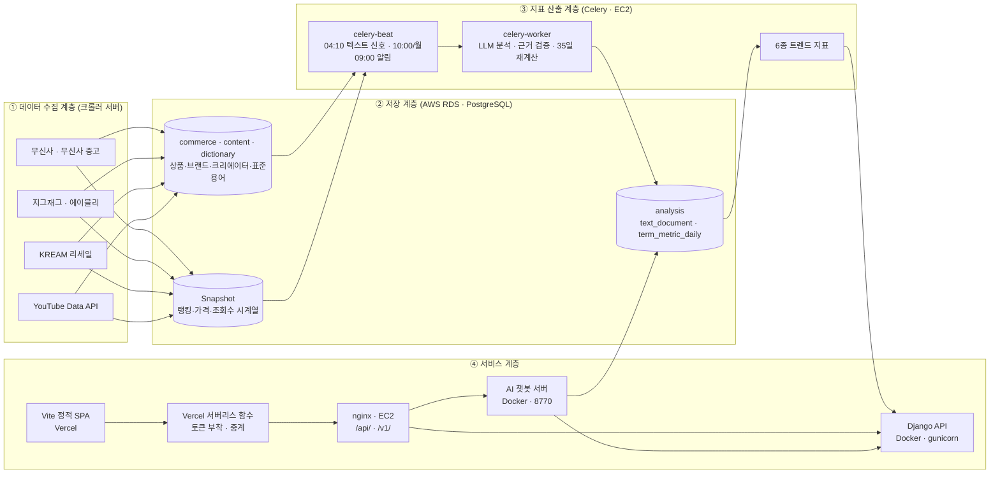
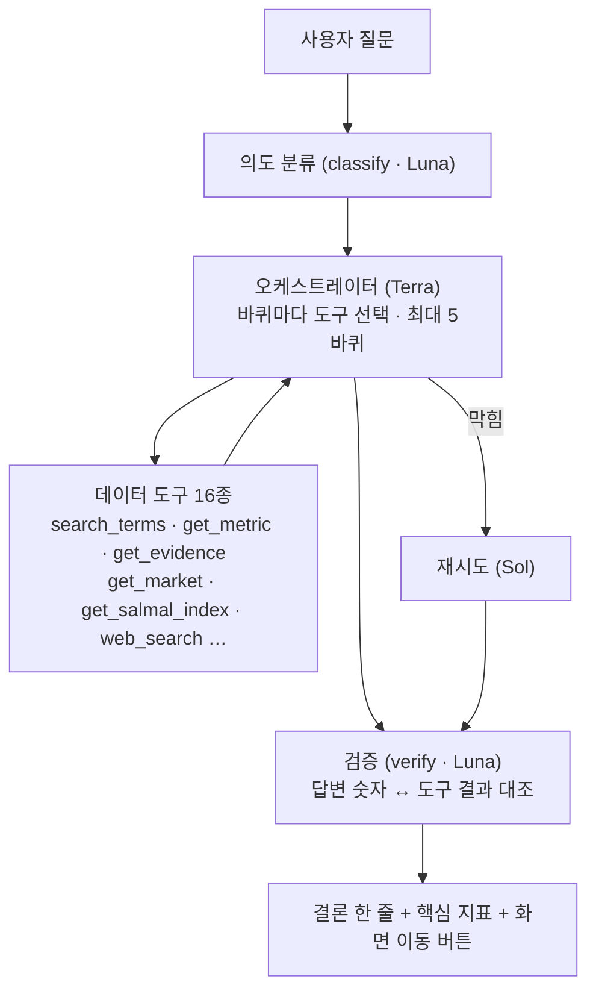
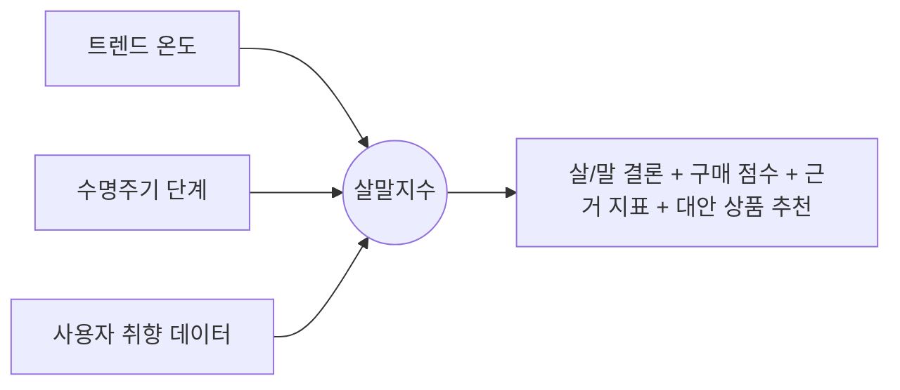
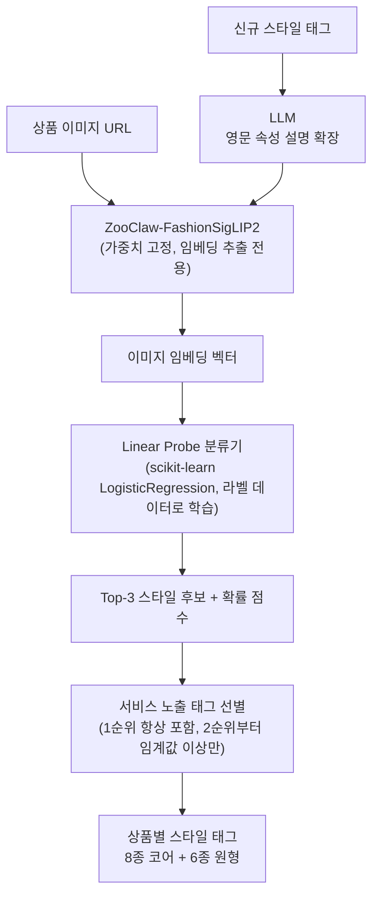
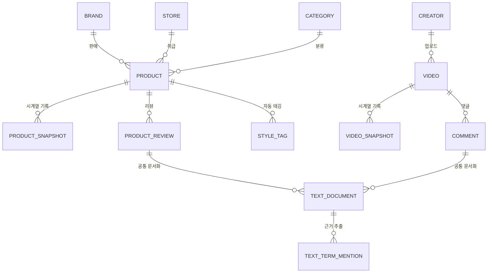

<div align="center">


# FEEDiT
### [FEEDiT - 배포 링크](https://fee-di-t-frontend.vercel.app/)

**패션 트렌드를 물어보고, 분석하고, 결정한다. 나만의 스타일 컨설팅  AI**

커머스·유튜브 데이터를 모아 6개 트렌드 지표로 계산하고, AI 챗봇이 지표를 해석해주며,   
살까 말까 고민되는 상품은 커뮤니티 투표로 정할 수 있는 AI 기반 패션 트렌드 플랫폼


</div>

---

## 목차

1. [팀 소개](#1-팀-소개)
2. [프로젝트 개요](#2-프로젝트-개요)
3. [핵심 기능](#3-핵심-기능)
4. [기술 스택](#4-기술-스택)
5. [시스템 아키텍처](#5-시스템-아키텍처)
6. [핵심 기술 상세](#6-핵심-기술-상세)
7. [데이터 설계](#7-데이터-설계)
8. [배포 정보 및 실행 방법](#8-배포-정보-및-실행-방법)
   - [8-1. 배포 구성 한눈에](#8-1-배포-구성-한눈에)
   - [8-2. 처음 받은 사람 — 공통 준비](#8-2-처음-받은-사람--공통-준비)
   - [8-3. 로컬 개발 — 백엔드](#8-3-로컬-개발--백엔드)
   - [8-4. 로컬 개발 — 프론트엔드](#8-4-로컬-개발--프론트엔드)
   - [8-5. 로컬 개발 — 챗봇](#8-5-로컬-개발--챗봇)
   - [8-6. 운영 서버(EC2) — API + 정기 작업](#8-6-운영-서버ec2--api--정기-작업)
   - [8-7. 운영 서버(EC2) — 챗봇](#8-7-운영-서버ec2--챗봇)
   - [8-8. 정기 작업 (Celery beat · Asia/Seoul)](#8-8-정기-작업-celery-beat--asiaseoul)
   - [8-9. Vercel 배포 · 환경변수](#8-9-vercel-배포--환경변수)
   - [8-10. 운영 점검](#8-10-운영-점검)
   - [8-11. 알파 테스트 모드 (시연 한정)](#8-11-알파-테스트-모드-시연-한정)

---

## 1. 팀 소개

| 유진영 | 고현아 | 김봉남 | 안혁진 | 전서연 |
| :---: | :---: | :---: | :---: | :---: |
| <a href="https://github.com/ujneg18-source"> | <a href="https://github.com/"> | <a href="https://github.com/bongrybong"> | <a href="https://github.com/Jinxxxok"> | <a href="https://github.com/sxoxyn"> |
| <b>PM</b> | <b>BE</b> | <b>BE</b> | <b>FE</b> | <b>FE</b> |

---

## 2. 프로젝트 개요

### **프로젝트명** : FEEDiT

**FEEDiT**은 무신사·에이블리·지그재그 등 국내 주요 패션 커머스와 패션 유튜브 콘텐츠 데이터를 수집·분석하여, 지금 어떤 스타일과 아이템이 뜨고 있는지를 트렌드 지표로 보여주고, AI 챗봇을 통해 "이거 사도 될지" 판단을 도와주는 LLM 기반 서비스입니다.

단순히 트렌드를 소개하는 것을 넘어, 사용자의 취향·체형·행동 데이터를 기반으로 개인화된 트렌드 브리핑과 구매 의사결정 조언을 제공하고, 살까 말까 고민되는 상품을 다른 사용자와 함께 투표하는 커뮤니티 기능(살!말?)까지 하나의 서비스 안에서 제공합니다.

```
[커머스/유튜브 데이터 수집] → [6종 트렌드 지표 산출] → [AI 챗봇 · 내 피드 개인화 안내]
                                                              └→ [살!말? 커뮤니티 투표 · 구매 결정]
                                                                        └→ [투표·만족도 데이터를 다시 개인화 추천에 반영]
```

### 2-1. 개발 배경

패션 트렌드는 하루가 다르게 변하지만, 일반 소비자가 이를 객관적인 데이터로 파악하기는 어렵습니다. FEEDiT은 누구나 한 번쯤 겪어본 쇼핑 과정의 4가지 고민에서 출발했습니다.

**기존 패션 쇼핑의 한계**

1) **감에 의존하는 트렌드** : "요즘 뜬다"는 말은 많지만, 실제 언급량이 얼마나 늘었는지, 유행의 정점을 지났는지 숫자로 보여주는 곳이 없습니다.

2) **구매 직전의 망설임** : "지금 사면 유행 끝물은 아닐까?", "나중에 더 싸지지 않을까?" 결제를 앞두고 판단할 명확한 근거가 부족합니다.

3) **파편화된 정보** : 가격과 할인율은 쇼핑몰에, 화제성은 유튜브나 SNS에, 리셀 시세는 별도 앱에 흩어져 있어 한눈에 비교하기 번거롭습니다.

4) **단절된 쇼핑 경험** : 큰맘 먹고 산 옷이 만족스러웠는지 피드백이 남지 않아, 다음 쇼핑에서도 나에게 최적화된 추천을 받기 어렵습니다.

💡 **FEEDiT의 해결책** : 데이터 선순환 구조  
FEEDiT은 감이 아닌 '데이터'로 의사결정을 돕습니다. 흩어진 커머스와 콘텐츠 데이터를 모아 정량적 지표로 변환하고, AI 챗봇과 커뮤니티 투표(살!말?)로 구매 고민을 명쾌하게 해결합니다. 나아가 구매 후 만족도를 다시 알고리즘에 반영해, 쓸수록 내 취향에 맞춰 똑똑해지는 쇼핑 경험을 제공합니다.

---

## 3. 핵심 기능

| 기능 영역 | 설명 | 핵심 기술 |
|---|---|---|
| **AI 챗봇** | 일반(트렌드 분석·컨설팅) 챗봇과 살!말? 판정 전용 챗봇 2종. 멀티모달(이미지) 입력, 대화 맥락 기억, 취향 기반 개인화 답변. 대화 기록은 RDS(`app.chat_session`·`app.chat_message`)에 저장되어 이어서 대화 가능 | 도구 호출형 오케스트레이터 + 16종 데이터 도구 |
| **트렌드 지표 (EDIT)** | 언급량·트렌드 온도, 연관어(5축), 긍부정(구매의향), 할인률 변화, 리세일 시세 지수, 수명주기 등 6종 지표 | 텍스트 신호 파이프라인 + Commerce/Content Snapshot 집계 |
| **내 피드 (FEED)** | 취향 브리핑, 취향 맞춤 살!말? 큐레이션, 금주의 리포트, 찜한 키워드 상태 변화, 활동 배지 현황 | 사용자 행동 로그(`app.user_event`) 기반 개인화 |
| **패션 검색** | 패션 전용 사전 기반 키워드 검색 및 스타일→브랜드→종류→상품명 드릴다운 검색 | `dictionary` 스키마(표준 용어·별칭·브랜드), 자동완성 |
| **살!말?** | 고민 상품 등록 후 실시간 투표(살/말), 인기순·최신순·마감임박·내취향 정렬, 48시간 자동 마감, 댓글, 마감 후 사후 피드백(1회 작성·수정 불가) | 실시간 투표 처리, 취향 매칭, 적중 판정 |
| **알림 센터** | 가격 하락·투표 결과·주간 리포트·배지 획득·용어 등재·직업 인증 심사·살!말? 새 댓글 7종 알림, 우측 상단 토스트, 알림별 수신 설정 | Celery 정기 작업 + `app.notification` |
| **계정·권한** | 이메일 가입 / Google 로그인, 취향(스타일·체형) 등록, 직업 인증 신청과 관리자 심사, 플랜 필드(`app_user.plan`), ADMIN 슈퍼계정 | Django 세션 + Vercel 함수 중계 |
| **스타일** | 원형 6종 + 코어 스타일 8종(총 14종)을 에디토리얼 인덱스로 탐색하고, 스타일별 상세(기원·확산 계기·핵심 키워드·대표 리세일 브랜드) 제공. '이 스타일의 아이템'에는 ZooClaw-FashionSigLIP2로 자동 태깅된 상품이 노출 | 스타일 상세 콘텐츠 + 자동 태깅 결과 연동 |
| **요금제** | 프리 / 프로 / 비즈니스 3단계 요금제 및 플랜별 기능·챗봇 응답 차등 제공 (공개 베타 중에는 전 기능 개방) | 권한 기반 API 제어 |
| **관리자(Admin)** | 수집 현황·이력 조회, 수집 대상 관리, 데이터 품질(누락·중복) 관리, 오류 모니터링, 지표 재계산, 직업 인증 심사 | `/admin-dashboard/` + DRF 수집 API |
| **텍스트 신호 자동화** | 매일 새벽 YouTube 댓글 수집 → 커머스 리뷰 동기화 → LLM 구조화 분석 → 근거 검증 → 35일 지표 재계산 | Celery beat/worker + OpenAI API |
| **AI 자동 태깅 파이프라인** | 상품 이미지에 대한 스타일 자동 분류 | ZooClaw-FashionSigLIP2 + Linear Probe + LLM 매핑 |
| **알파 테스트 계정** | 시연 기간 한정으로 가입 없이 임시 계정을 즉시 발급(플랜 `TEST`), 계정당 챗봇 사용 횟수 제한 | `backend/apps/api/alpha_views.py` (기간 종료 시 파일째 제거) |

---

## 4. 기술 스택

| 구분 | 기술 |
|---|---|
| **Frontend** |    — 바닐라 JS 멀티페이지 SPA |
| **Backend** |     |
| **AI / LLM** |  `gpt-5.6-terra`(판단·도구 선택) · `gpt-5.6-luna`(닫힌 출력·검증) · `gpt-5.6-sol`(막혔을 때 재시도) |
| **Data Collection** |   — 무신사 / 무신사 중고 / 지그재그 / 에이블리 / KREAM |
| **ML / Auto-Tagging** | ZooClaw-FashionSigLIP2(이미지 임베딩) + scikit-learn Linear Probe 분류기 + LLM(스타일 속성 확장) + RunPod(GPU 학습) |
| **Database** |  — `collection` · `content` · `commerce` · `dictionary` · `analysis` · `app` 6개 스키마 |
| **Infrastructure** |       |
| **Collaboration** |   |

> **DB는 AWS RDS(PostgreSQL)입니다.** Django `search_path` 는 `dictionary,"$user",public` 으로 설정되어 있고,
> 나머지 스키마는 모델에서 명시적으로 지정합니다.
> 운영 서버(EC2)에서는 같은 VPC 안이라 RDS에 직접 접속하고, **SSM 터널은 로컬 개발에서만** 씁니다.

---

## 5. 시스템 아키텍처

FEEDiT은 **데이터 수집 → 저장 → 지표 산출 → 서비스 제공**의 4단계 파이프라인으로 구성됩니다.
수집(크롤링)은 별도 크롤러 서버가 맡고, 운영 API 서버는 **읽기 + 정기 분석**만 담당합니다.



**요청 경로** — 브라우저는 백엔드 주소를 모릅니다. 모든 호출이 Vercel 함수를 거칩니다.

```text
브라우저 → Vercel 함수(BACKEND_API_TOKEN / CHAT_BACKEND_TOKEN 부착)
         → nginx(EC2)  ├─ /api/  → Django(127.0.0.1:8001) → RDS
                       └─ /v1/   → 챗봇(127.0.0.1:8770)  → RDS · Django API
```

- Django는 `127.0.0.1` 에만 묶여 있어 인터넷에서 직접 닿지 않습니다. `/admin/` 은 **공개하지 않고**, 필요할 때 SSH 포트 포워딩으로만 씁니다.
- 챗봇 컨테이너는 `feedit-api_default` 도커 네트워크에 함께 붙어 `http://feedit-api:8000/api` 로 지표 API를 직접 호출합니다(`get_market` 도구).

---

## 6. 핵심 기술 상세

### 6-1. AI 챗봇 — 도구 호출형 오케스트레이터

질문 하나를 여러 '바퀴(turn)'로 나눠, 매 바퀴마다 필요한 데이터 도구를 고르고 결과를 보고 다시 고릅니다.
모델은 **역할별로 다른 등급**을 씁니다 — 판단은 비싸게, 형식 변환은 싸게.

| 역할 | 모델 | 하는 일 |
|---|---|---|
| orchestrator · interpreter · advisor | `gpt-5.6-terra` | 도구 선택, 숫자 → 판단, 살!말? 결론 |
| quote · verify · polish · ask · classify | `gpt-5.6-luna` | 원문 발췌, 값 대조, 형식 변환, 되묻기, 의도 분류 |
| (재시도) | `gpt-5.6-sol` | Terra·Luna가 막혔고 시간이 남았을 때 같은 바퀴를 다시 |



- **데이터 원본** : 운영 RDS 직결(`FEEDIT_DATA_BACKEND=rds`). 예전처럼 크롤러 SQLite를 마운트하지 않습니다. 질문 문장 추출 코드(`FEEDIT_EXTRACTOR_DIR`)만 읽기 전용으로 붙입니다.
- **일반 챗봇** : 트렌드 분석 → 취향분석/상품추천/트렌드지표, 상품 링크 판독, 리포트 생성·저장·공유, AI 가상 피팅 이미지 생성
- **살!말? 챗봇** : 트렌드 온도 + 수명주기 + 사용자 취향을 결합한 **살말지수**로 조언하고, 고민이 더 필요하면 살!말? 커뮤니티 등록으로 유도
- **시간 예산** : 질문당 45초(상품 링크가 포함된 질문은 +15초), 한 번의 모델 호출은 30초 상한. 도구 호출은 최대 5바퀴·14회로 묶고, 마지막 바퀴는 데이터 도구 없이 답을 쓰는 데만 씁니다.
- **사용량 집계** : 응답 시간 + 5분 이내 읽기 시간을 `app.user_event` 에 누적하므로, 대화방을 지워도 사용 시간은 남습니다.

### 6-2. 텍스트 신호 파이프라인 — 리뷰·댓글을 지표로

YouTube 댓글과 커머스 리뷰를 서로 다른 스크립트로 다루지 않고 **공통 문서 계약(`analysis.text_document`)** 하나로 합칩니다.

```text
플랫폼 원문
  → S3 원본 보관 + collection.raw_document
  → analysis.text_document (source_id + document_type + external_id)
  → 1차 사전·신호 필터 (dictionary_term · term_alias)
  → 2차 LLM 구조화 분석 (용어 · 감성 · 구매의도)
  → 원문 근거 위치 검증 (evidence)
  → analysis.text_term_mention
  → term_metric_daily · term_assoc_daily (35일 재계산)
  → 백엔드 API + 챗봇
```

- 매일 **04:10(KST)** `core.refresh_text_signals_daily` 하나가 수집→동기화→분석→재계산을 순서대로 실행합니다.
- 콘텐츠 본문(영상 제목·설명·자막·기사)도 텍스트 신호에 포함됩니다.
- LLM 분석 비용은 `FEEDIT_TEXT_DAILY_ANALYSIS_LIMIT`(운영 기본 300건/일)로 상한을 둡니다. 0이면 무제한이라 첫날 밀린 문서를 한꺼번에 돌립니다.
- 분석용 OpenAI 키는 챗봇 키와 분리했습니다 — `FEEDIT_TEXT_OPENAI_API_KEY`.
- `analysis.pipeline_run` 에 모델·프롬프트 버전, 처리/실패 수, 토큰과 추정 비용을 실행 단위로 남깁니다.

### 6-3. 트렌드 지표 산출 — 데이터 소스 · 산출 방식

| 지표 | 주요 데이터 소스 | 산출 방식 개요 |
|---|---|---|
| 언급량 · 트렌드 온도 | `analysis.term_metric_daily` | 언급 횟수에 플랫폼 규모·계절 요인을 보정해 0~100 온도로 환산 |
| 연관어 (5축) | `analysis.term_assoc_daily` | 같은 문서에서 함께 검증된 용어를 아이템·소재·컬러·핏·상황 5개 축으로 집계, lift/PMI와 전주 대비 증감 산출 |
| 긍부정 (구매의향) | `analysis.text_term_mention` | 단순 감정이 아닌 구매의향 기준으로 분류, 표본 수축(shrinkage)으로 소표본 왜곡 방지. 근거 문장을 원문 위치까지 보관해 팝업으로 제시 |
| 할인률 변화 | `commerce.product_source` 스냅샷 | 정가·판매가·할인율·재고 시계열에서 최저가 시점과 할인 패턴 계산 |
| 리세일 시세 지수 | KREAM · 무신사 중고 체결가 | 정가 대비 중고가 비율로 가치 유지율·프리미엄/디스카운트 산출, 스타일별 대표 브랜드는 집중도 기준 |
| 수명주기 | 누적 언급량 추이 | 태동·확산·정점·쇠퇴 4단계 판정, 정점 이후 로지스틱 피팅으로 잔여 기간 추정 (판매량이 없으면 언급량만으로) |

### 6-4. 살!말? 지수 산출



투표가 마감되면(48시간) 글쓴이에게 **사후 피드백**을 받아 실제 구매 여부와 후회/만족을 기록하고,
그 결과로 참여자의 '적중' 배지와 여론 조력자 배지를 계산합니다. 피드백은 판정 근거를 고정하기 위해 **한 번만** 작성할 수 있습니다.

### 6-5. 패션 이미지 자동 스타일 태깅 파이프라인

상품 이미지에 스타일 태그를 자동으로 부여하는 파이프라인으로, **ZooClaw-FashionSigLIP2(이미지 임베딩)** 는 가중치를 고정한 채 임베딩 추출 용도로만 사용하고, 그 위에 라벨 데이터로 학습한 **Linear Probe(로지스틱 회귀) 분류기**를 얹는 구조입니다.



- **학습 데이터** : 실제 서비스 이미지를 수작업 태깅한 라벨 데이터셋(v4 기준 5,142장, 14개 클래스)으로 Linear Probe를 재학습
- **인프라** : 임베딩 추출·학습은 RunPod GPU에서 수행하고, 학습된 확률 분류기(.joblib)만 저장해 이후에는 가벼운 CPU 추론으로 서비스에 반영
- **LLM 활용 지점** : 신규 스타일이 추가될 때, 한글 스타일명을 시각적 특징(실루엣·소재·색상·대표 아이템) 중심의 영문 프롬프트로 확장
- 현재 버전(v4) 기준 실질 정확도는 약 0.81 수준으로 확인되었습니다.
- **서비스 연동** : 태깅된 스타일 태그는 스타일 페이지의 '이 스타일의 아이템' 영역에 반영됩니다.

---

## 7. 데이터 설계

### 7-1. 스키마 구성 (AWS RDS · PostgreSQL)

| 스키마 | 주요 테이블 | 역할 |
|---|---|---|
| `collection` | `source` · `crawl_target` · `crawl_run` · `raw_document` | 수집 대상·실행 이력·S3 원본 위치 |
| `content` | `content_profile` · `content_item` | YouTube 채널과 영상의 안정 키 |
| `commerce` | `product` · `product_source` · `product_review` · `product_term` · `product_term_relation` | 표준 상품, 플랫폼별 상품·가격 스냅샷, 리뷰, 속성 연결 |
| `dictionary` | `dictionary_term` · `term_alias` · `term_candidate` · `brand` · `category` · `style` · `item` · `material` · `color` · `tpo` | 표준 용어·별칭·미등록 후보와 패션 도메인 사전 |
| `analysis` | `text_document` · `text_term_mention` · `term_metric_daily` · `term_assoc_daily` · `platform_metric_daily` · `pipeline_run` | 공통 텍스트, 검증 근거, 트렌드·연관 지표, 파이프라인 감시 |
| `app` | `app_user` · `chat_session` · `chat_message` · `user_event` · `user_taste` · `user_saved_item` · `notification` · `notification_setting` · `term_request` · `vote_card` · `vote_ballot` · `vote_comment` · `vote_feedback` · `vote_report` | 사용자·챗봇 대화·행동·알림·투표 서비스 |

### 7-2. Commerce / Content — Master · Snapshot 구조

| 데이터 영역 | 구분 | 주요 수집 대상 | 제공 가치 |
|---|---|---|---|
| Commerce | Master | 상품, 브랜드, 스토어, 카테고리, 상품 URL, 이미지 | 상품·브랜드·스토어 기준 정보 구성 |
| Commerce | Snapshot | 랭킹, 가격, 할인율, 리뷰 수, 좋아요·관심 지표, 수집 시점 | 상품 인기 변화, 가격 변화, 급상승·하락 추적 |
| Content | Master | Creator, Video, 제목, 게시일, 설명, 카테고리 | 패션 콘텐츠와 크리에이터 구조 파악 |
| Content | Snapshot | 조회수, 좋아요, 댓글 등 반응 지표 | 콘텐츠 확산 속도와 패션 화제성 측정 |



- **Commerce Master**는 상의·하의·원피스·아우터 4개 상위 카테고리의 월간랭킹 기준으로 수집합니다. 공용/남성/여성으로 구분하며, 원피스는 공용·남성 카테고리에서 제외합니다.
- **Commerce Snapshot**은 2024년 1월~2026년 7월 데이터를 Backfill로 확보하고, 2026년 8월 20일부터 신규 데이터를 누적합니다.
- **Content**는 등록된 패션 크리에이터 채널(`content_profile`)을 기준으로 매일 갱신하며, CrawlTarget 활성 여부와 무관하게 동작합니다.

### 7-3. 수집 아키텍처 원칙

플랫폼별 Collector를 독립적으로 운영하고 공통 처리 과정과 저장 계층을 공유합니다. 한 플랫폼의 페이지 구조가 바뀌어도 다른 Collector에 영향을 주지 않습니다.

- **Commerce** : Playwright 기반 동적 크롤링 (`backend/collection/{musinsa, musinsa_used, zigzag, ably, kream}`), 요청 간 딜레이 적용
- **Content** : YouTube Data API v3 (`backend/collection/youtube`)
- **공통** : `backend/collection/common` 의 http·정규화·파이프라인·S3 모듈을 공유
- **실행 위치** : 크롤링(`core.dispatch_due_targets`)은 Playwright·OCR이 있는 **크롤러 서버**에서만 돌립니다. API 서버는 `CELERY_CRAWL_DISPATCH=0` 으로 꺼 둡니다.

---

## 8. 배포 정보 및 실행 방법

### 8-1. 배포 구성 한눈에

| 구분 | 위치 | 비고 |
|---|---|---|
| 🌐 Frontend | https://fee-di-t-frontend.vercel.app/ | Vercel · 저장소의 `frontend/` 를 Root Directory 로 사용 |
| 🔀 API 중계 | Vercel 서버리스 함수 (`frontend/api/`) | 브라우저 대신 토큰을 붙여 백엔드를 호출 |
| 🖥 백엔드 API | `https://feedit-official.duckdns.org/api/` | EC2 · nginx → Django(Docker, `127.0.0.1:8001`) |
| 🤖 챗봇 API | `https://feedit-official.duckdns.org/v1/` | EC2 · nginx → 챗봇(Docker, `127.0.0.1:8770`) |
| 🗄 데이터베이스 | AWS RDS (PostgreSQL) | EC2에서는 VPC 내부 직결, 로컬은 SSM 터널 |
| 📦 원본 보관 | AWS S3 | 수집 원본 JSON |

Docker Compose 파일은 용도별로 나뉩니다.

| 파일 | 어디서 | 올라가는 것 |
|---|---|---|
| `docker/compose.yml` | 로컬 개발 | ssm-tunnel(프로필 `tunnel`) · redis · web(runserver) · chatbot |
| `docker/compose.api.yml` | 운영 EC2 | api(gunicorn) · redis · celery-worker · celery-beat — **프로젝트명 `feedit-api`** |
| `docker/compose.chat.yml` | 운영 EC2 | chatbot · (선택) Caddy — 앞단 nginx가 있으면 Caddy는 띄우지 않음 |
| `docker/compose.prod.yml` | 단독 서버 | Django + 챗봇 + Caddy 를 한 서버에 몰아넣는 예전 구성 |

> ⚠ `compose.api.yml` 과 `compose.chat.yml` 은 **프로젝트 이름이 다릅니다.** 같은 이름으로 묶이면
> `--remove-orphans` 한 번에 챗봇이 지워집니다. 두 파일을 한 명령에 섞지 마세요.

### 8-2. 처음 받은 사람 — 공통 준비

```bash
git clone https://github.com/feedit-official/feedit.git
cd feedit
cp .env.example .env      # 값을 채웁니다. .env 는 커밋하지 않습니다.
```

`.env.example` 에 무엇을 왜 넣는지 항목마다 적어 뒀습니다.
**AWS 키와 OpenAI 키는 각자 발급받아 쓰세요.** 공용 키를 돌려쓰면
한도가 한 번에 소진되고, 누가 무엇을 했는지 추적이 안 됩니다.

핵심 값만 추리면 이렇습니다.

| 변수 | 쓰는 곳 |
|---|---|
| `DJANGO_SECRET_KEY` · `DJANGO_DEBUG` | Django 기본 설정 |
| `DB_NAME` · `DB_USER` · `DB_PASSWORD` · `DB_HOST` · `DB_PORT` | RDS 접속 (로컬은 `127.0.0.1:5433` = 터널, 서버는 RDS 주소:5432) |
| `AWS_*` · `EC2_INSTANCE_ID` · `RDS_HOST` | SSM 터널과 S3 |
| `OPENAI_API_KEY` | 챗봇 |
| `FEEDIT_TEXT_OPENAI_API_KEY` | 리뷰·댓글 LLM 분석 (챗봇 키와 분리) |
| `YOUTUBE_API_KEY` | 콘텐츠 수집 |
| `FEEDIT_API_TOKEN` | Django `/api/` 공유 토큰 — Vercel `BACKEND_API_TOKEN` 과 같은 값 |
| `FEEDIT_CHAT_TOKEN` | 챗봇 공유 토큰 — Vercel `CHAT_BACKEND_TOKEN` 과 같은 값 (공개 베타 중엔 무시됨) |
| `GOOGLE_CLIENT_ID` · `GOOGLE_CLIENT_SECRET` | Google 로그인 |

### 8-3. 로컬 개발 — 백엔드

```bash
# ① Docker Desktop 실행
# ② RDS 로 가는 SSM 터널 + Django + Redis
docker compose --env-file .env -f docker/compose.yml --profile tunnel up --build
```

- 관리자 대시보드 : http://localhost:8000/admin-dashboard/ (루트 `/` 도 여기로 넘어갑니다)
- Django 관리자 : http://localhost:8000/admin/
- API : http://localhost:8000/api/health

터널 없이(이미 다른 경로로 DB에 닿을 때)는 `--profile tunnel` 을 빼면 됩니다.

```bash
docker compose --env-file .env -f docker/compose.yml down     # 종료
```

### 8-4. 로컬 개발 — 프론트엔드

```bash
cd frontend
npm install
npm run dev        # http://localhost:5173
npm test           # 25개 UI·API 회귀 테스트 (node + jsdom)
```

`vite.config.js` 가 `/api/…` 를 로컬 백엔드로, `/api/v1/…` 를 챗봇으로 프록시합니다.
**백엔드나 챗봇을 안 켜도 화면은 돕니다** — 목업으로 떨어집니다.

### 8-5. 로컬 개발 — 챗봇

챗봇은 **운영 RDS를 직접 읽습니다**(`FEEDIT_DATA_BACKEND=rds`). 크롤러 저장소를 통째로 받아 둘 필요가 없습니다.

```bash
# ① 준비물 점검 (네트워크 안 씀)
python3 ChatBot/tools_env_check.py
python3 ChatBot/tools_llm_check.py     # 모델을 실제로 한 번 불러 봅니다

# ② 실행
docker compose --env-file .env -f docker/compose.yml up chatbot    # 또는
cd ChatBot && python3 server.py                                    # http://127.0.0.1:8770
```

필요한 것은 `DB_*` 네 값과 `OPENAI_API_KEY`, 그리고 질문 문장 추출 코드 위치(`FEEDIT_EXTRACTOR_DIR`)뿐입니다.
빠진 게 있으면 `server.py` 가 **무엇이 없는지 말하고 종료 코드 2로 멈춥니다.**

- `FEEDIT_LLM_DISABLED=1` — OpenAI 키 없이 규칙만으로 동작
- `FEEDIT_DATA_BACKEND=sqlite` — 회귀 테스트용 SQLite 어댑터 (이때만 `FEEDIT_CRAWLER_DIR` 이 필요합니다)
- **공개 베타 기본값은 `FEEDIT_PUBLIC_BETA=1`** 입니다. 이 동안에는 `FEEDIT_CHAT_TOKEN` 이 있어도 무시하고 모든 기능을 BUSINESS 플랜과 동일하게 엽니다. IP 당 분당 제한(`FEEDIT_CHAT_RATE_PER_MIN`, 기본 20)은 그대로 살아 있습니다.

### 8-6. 운영 서버(EC2) — API + 정기 작업

```bash
# 서버 셸 (SSH 키 없이)
aws ssm start-session --target <인스턴스ID> --region ap-northeast-2
sudo su - ubuntu          # ssm-user 는 docker 권한이 없다

cd feedit && git pull
docker compose --env-file .env -f docker/compose.api.yml up -d --build
```

서버 `.env` 에 있어야 할 것 :

```bash
DJANGO_SECRET_KEY=...
DB_HOST=feedit-db.<...>.ap-northeast-2.rds.amazonaws.com   # 터널이 아니다
DB_PORT=5432
FEEDIT_API_TOKEN=<버셀 BACKEND_API_TOKEN 과 같은 값>
FEEDIT_TEXT_OPENAI_API_KEY=sk-...
API_PORT=8001                                              # nginx proxy_pass 와 맞춘다
DJANGO_CSRF_TRUSTED_ORIGINS=https://fee-di-t-frontend.vercel.app,https://feedit-official.duckdns.org
```

> ★ `FEEDIT_API_TOKEN` 을 비우면 `/api/` 가 누구에게나 열립니다. 사전(브랜드 3,716행)과 상품이 그대로 긁힙니다.

올라가는 컨테이너 :

| 컨테이너 | 하는 일 |
|---|---|
| `feedit-api` | gunicorn 3워커 · `127.0.0.1:${API_PORT}` · 기동 시 `collectstatic` 만 수행 |
| `feedit-redis` | Celery 브로커 전용 (저장 안 함, 64MB 상한) |
| `feedit-celery-worker` | `default`·`analysis` 큐, 동시성 1 |
| `feedit-celery-beat` | 정기 작업 스케줄 |

**migrate 는 여기서 돌리지 않습니다.** 이 API는 읽기 전용이고, 스키마 변경은 사람이 확인하고 한 번만 적용합니다.

nginx 설정은 `docker/nginx-feedit-api.conf` 의 `location /api/` 블록을 챗봇 `/v1/` 이 들어 있는 같은 `server { }` 에 넣고 반영합니다.

```bash
sudo nginx -t && sudo systemctl reload nginx
```

### 8-7. 운영 서버(EC2) — 챗봇

```bash
docker compose --env-file .env -f docker/compose.chat.yml up -d --build
```

- 챗봇은 `127.0.0.1:8770` 에만 열리고, 앞단 nginx(`docker/nginx-feedit-chat.conf`)가 `/v1/` 을 넘깁니다.
- `feedit-api_default` 외부 네트워크에 함께 붙으므로 `compose.api.yml` 이 **먼저** 올라와 있어야 합니다.
- 앞단 nginx가 없는 서버라면 Caddy가 HTTPS까지 맡습니다 — `--profile standalone` 을 붙입니다. 이때는 도메인 A 레코드와 보안그룹 80·443 인바운드가 필요합니다.
- 질문 문장 추출 코드는 `${CHAT_DATA_DIR:-/opt/feedit-chat-data}/tools` 를 읽기 전용으로 마운트합니다.

### 8-8. 정기 작업 (Celery beat · Asia/Seoul)

| 시각 | 작업 | 내용 |
|---|---|---|
| 매일 04:10 | `core.refresh_text_signals_daily` | YouTube 댓글 수집 → 커머스 리뷰 동기화 → LLM 분석 → 35일 지표 재계산 |
| 매일 10:00 | `app.notify_daily` | 찜한 상품 가격 하락(하루 한 번 묶어서) · 용어 사전 등재 알림 |
| 일요일 18:00 | `app.notify_weekly` | 주간 트렌드 리포트 알림 |
| 1분마다 | `core.dispatch_due_targets` | 크롤 대상 실행 — **API 서버에서는 꺼 둠**(`CELERY_CRAWL_DISPATCH=0`) |

### 8-9. Vercel 배포 · 환경변수

Vercel 프로젝트는 이 저장소의 **`frontend/` 폴더를 Root Directory** 로 봅니다.
그 안의 `vercel.json` · `package.json` · `api/` 를 그대로 쓰므로 코드는 고칠 게 없습니다.
모노레포이므로 Ignored Build Step 을 `frontend` 폴더 변경으로 제한해 두면 불필요한 재빌드를 줄일 수 있습니다.

| 변수 | 쓰는 곳 | 없으면 |
|---|---|---|
| `BACKEND_API_URL` | 모든 `/api/*` 함수 — Django 주소 (예: `https://feedit-official.duckdns.org/api`) | 로그인·지표가 503, 일부는 RDS 직결로 강등 |
| `BACKEND_API_TOKEN` | 함수가 `X-FEEDiT-Token` 으로 붙임 | 서버가 토큰을 요구하면 401 |
| `CHAT_BACKEND_URL` | `/api/v1/*` — 챗봇 서버 주소 | 챗봇이 목업 답변으로 떨어짐 |
| `CHAT_BACKEND_TOKEN` | `/api/v1/chat` — 베타 종료 후 챗봇 공유 토큰 | 공개 베타에서는 불필요 |
| `DATABASE_URL` 또는 `PGHOST`·`PGPORT`·`PGUSER`·`PGPASSWORD`·`PGDATABASE` | RDS 직결 폴백 | 폴백 경로가 '측정 불가' |

> 함수가 `CHAT_BACKEND_URL + '/v1/chat'` 을 부르므로 주소 끝에 경로를 붙이지 마세요.
>
> ⚠ 서버리스 함수는 **Hobby 요금제 기준 12개 상한**입니다. 그래서 `api/[kind].js` 가 discount·resale·lifecycle·price-history·sentiment 를,
> `api/v1/[name].js` 가 chat·feedback·fit-classify·health·magazines 를 한 파일로 받습니다. 새 주소를 추가할 때는 파일을 늘리지 말고 이 안에 넣으세요.

### 8-10. 운영 점검

```bash
# 프론트 → 백엔드까지
curl -s https://fee-di-t-frontend.vercel.app/api/health      # 표별 행 수와 지표 컬럼
curl -s https://fee-di-t-frontend.vercel.app/api/v1/health   # 챗봇 연결 (200이면 붙음)

# 백엔드 직접 — 토큰 없이 부르면 401 이 정상
curl -i -X POST https://feedit-official.duckdns.org/v1/chat \
  -H 'Content-Type: application/json' -d '{"question":"발레코어 어때?"}'

# 서버에서
docker compose -f docker/compose.api.yml logs -f celery-worker
docker compose -f docker/compose.chat.yml logs -f chatbot
```

### 8-11. 알파 테스트 모드 (시연 한정)

가입 없이 임시 계정을 발급해 바로 서비스를 쓰게 하는 기능입니다. `backend/apps/api/alpha_views.py` 하나에 모여 있어 **기간이 끝나면 파일째 지우면 됩니다.**

| 변수 | 기본값 | 뜻 |
|---|---|---|
| `FEEDIT_ALPHA_MODE` | `1` (켜짐) | `0` 으로 두면 발급 중단 (이미 받은 계정은 유지) |
| `FEEDIT_ALPHA_UNTIL` | 없음 | `2026-10-05` 처럼 두면 그날까지만 발급 (KST, 당일 포함) |
| `FEEDIT_ALPHA_CHAT_QUOTA` | `20` | 계정당 챗봇 누적 허용 횟수 |

> 발급된 계정의 플랜은 `TEST` 입니다.
> 챗봇은 Django와 별개 서버라 세션을 모르므로, 횟수 차감은 프론트가 전송 직전에 요청하는 구조입니다.
> 안내·집계 목적이며 원가를 강제로 막는 장치는 챗봇 서버의 IP 한도입니다.

---

<div align="center">

**FEEDiT** — SK네트웍스 Family AI 31기 4팀

</div>
